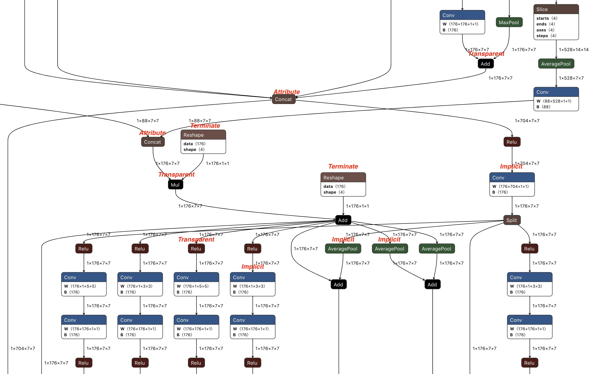

Data Layout Semantic Conversion
===============================

This document, which is originally written in the [introducing blog](https://jackwish.net/2020/Convert-TensorFlow-Lite-models-to-ONNX.html), covers the _layout semantic divergence_ between TensorFlow Lite (TFLite) models which is NHWC and ONNX which is NCHW.

The data layout format of TFLite has not been mentioned in either the document or the [model representation](https://github.com/tensorflow/tensorflow/blob/v2.1.0/tensorflow/lite/schema/schema.fbs) but in the implicit agreement of the [TFLite converter](https://github.com/tensorflow/tensorflow/blob/v2.1.0/tensorflow/lite/toco/import_tensorflow.cc#L795) (the TensorFlow model needs to be NHWC) and the [kernels](https://github.com/tensorflow/tensorflow/blob/v2.1.0/tensorflow/lite/kernels/conv.cc#L251). On the contrary, ONNX explicitly declares that it uses NCHW in both [operator representation](https://github.com/onnx/onnx/blob/6bdac246617682f9696f0dac40362ef4f4de2cde/onnx/defs/nn/defs.cc#L713) and document (which is generated from operator representation).

`tflite2onnx` introduces _propagation based approach_ to handle the layout issue in general, together with some other mechanisms for dedicated corner cases.

## Propagation based Approach

The _propagation based approach_ is introduced to resolve this by propagating the *layout semantic divergence* across the graph, in which way the _transpose pattern_ is not needed.

By default (for most cases), given a graph, some of the tensors have implicit layout semantic, e.g. tensors that are connected to `Conv` directly, while others are not, e.g. `Abs` and `Add`. The later ones are transparent to layout, where _transparent_ means all of the tensors that connected to the operator mush have the same layout semantic or don't hold such semantic.

So when an operator that is _transparent_ to layout is connected to an operator that has implicit layout tensors, then all tensors of the _transparent_ operator have the same layout semantic as the tensor that connecting these two operators, named as _propagation_.

For example, when converting the TFLite graph (omitted _kernel_ and _bias_)
$$\left< A_{nhwc} \right> \rightarrow [Conv] \rightarrow \left< B_{nhwc} \right> \rightarrow [Abs] \rightarrow \left< C_{?} \right>$$
to ONNX, tensor $$\left< A_{nhwc} \right>$$ becomes $$\left< A_{nchw} \right>$$ and $$\left< B_{nhwc} \right>$$ becomes $$\left< B_{nchw} \right>$$. Hence, the output $$\left< C \right>$$ of $$[Abs]$$ should have the same format as the input $$\left< B \right>$$. _Propagation based approach_ propagates the conversion from $$\left< B \right>$$ to $$\left< C \right>$$. Therefore we have the ONNX graph
$$\left< A_{nchw} \right> \rightarrow [Conv] \rightarrow \left< B_{nchw} \right> \rightarrow [Abs] \rightarrow \left< C_{nchw} \right>$$, where no additional operators nor tensors are introduced.

During layout propagation, the layout transformation permutes the shape of tensors if they are _activations_, i.e. value info in ONNX, and transposes the data of _weights_ in addition, i.e. initializer in ONNX.

In practice, operators are categorized into four (as marked in _Figure 5_):

* *Implicit*: operators have *layout semantic divergence*, e.g. `Conv`. They are the source of *layout semantic divergence*.
* *Transparent*: operators that are insensitive to layout, e.g. `Abs`. If any tensor has *layout semantic divergence*, propagate it to all tensors that are connected to such operators.
* *Attribute*: operators that can propagate *layout semantic divergence* just like _Transparent_, but have layout sensitive attributes that need special handling, e.g. attribute `axis` of  `Concat`. An additional pass after propagation to adjust these attributes is required. 
* *Terminate*: operators that don't have and cannot propagate *layout semantic divergence*, e.g. `Reshape`. The propagation across the graph terminates at such operators.

*Figure 1: Part of the ONNX model generated by propagation based approach of TFLite2ONNX*

When propagating *layout semantic divergence* across the graph, for a particular operator: if it is *Transparent* or *Attribute*, propagate *layout semantic divergence* among its tensors; if it is *Implicit* or *Terminate*, terminates the propagation in this direction. *Figure 1* is part of the ONNX model generated by *propagation based approach* from the [NASNet](https://tfhub.dev/tensorflow/lite-model/nasnet/mobile/1/metadata/1) TFLite model.

## Explicit Layout

With *propagation based approach*, the converted ONNX model includes zero effort to handle _layout semantic divergence_, i.e. no additional operators or tensors are introduced.

However, sometimes there could be incompatible layouts. Consider `Reshape`, which is *Terminate*, as below. If $$\left< A \right>$$ is propagated while other tensors are not, the output layout could be unexpected as the user may assume the dimensions of  $$\left< B \right>$$ has something to do with $$\left< A \right>$$. (*Transpose based approach* doesn't have this issue as its layout is TFLite style at the model level, *layout semantic divergence* is handled inside the $$[Transpose] \rightarrow [OP] \rightarrow [Transpose]$$ pattern.)

$$
\left.
  \begin{aligned}
    \{Graph\} \rightarrow \left< A \right> \rightarrow [Reshape] \rightarrow \left< B \right> \\
    \left< C \right> \\
  \end{aligned}
\right\} \rightarrow [Concat] \rightarrow \left< D \right>
$$

*Explicit layout* is introduced to handle such a scenario. Users can feed a mapping of $$\{Tensor\ name : tuple(TFLite\ layout, ONNX\ layout)\}$$ that describes the data layout of TFLite and ONNX to TFLite2ONNX. And, it's flexible for the user to define the layout conversion for non-_Transparent_ operators. For example, we have performed the NHWC to NCHW layout conversion for a TFLite graph that has only an `Add` operator.

## Broadcast of Propagation

Another problem is the [broadcast](https://numpy.org/doc/stable/user/basics.broadcasting.html) of binary operators such as `Add` (see [this issue](https://github.com/jackwish/tflite2onnx/issues/13) for more). Taking the example below, in which tensor $$\left< B \right>$$ needs to be broadcasted. If $$\left< A \right>$$ is converted from NHWC to NCHW, i.e. $$\left< A_{(2 \times 5 \times 3 \times 4)} \right>$$, $$\left< B \right>$$ is no longer broadcastable in ONNX. Even worse, the _layout semantic divergence_ will fail when propagated to $$\left< B \right>$$ as $$\left< A \right>$$ and $$\left< B \right>$$ have different dimensions.

$$
\left.
  \begin{aligned}
    \{Graph\} \rightarrow \left< A_{(2 \times 3\times 4 \times5)} \right> \\
    \left< B_{(4 \times 5)} \right> \\
  \end{aligned}
\right\} \rightarrow [Add] \rightarrow \left< C \right>
$$

To manage broadcasting in the ONNX model, `tflite2onnx` introduces the _Reshape pattern_. Any tensors like $$\left< B \right>$$ are reshaped to extend (inserting $$1$$) their dimensions to be equal with the other, such that propagation and broadcasting can correctly do their jobs. The example of the intermediate graph before propagation is as below.

$$
\left.
  \begin{aligned}
    \{Graph\} \rightarrow \left< A_{(2 \times 3\times 4 \times5)} \right> \\
    \left< B_{(4 \times 5)} \right> \rightarrow [Reshape] \rightarrow \left< B^{'}_{(1 \times 1 \times 4 \times 5)} \right>\\
  \end{aligned}
\right\} \rightarrow [Add] \rightarrow \left< C \right>
$$

